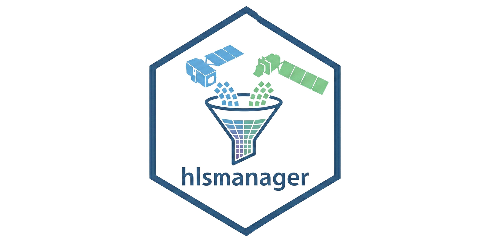
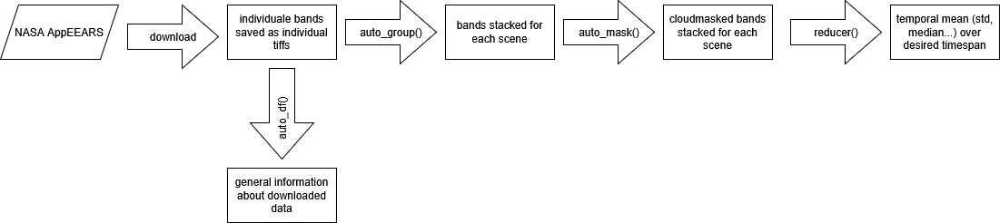

<!-- README.md is generated from README.Rmd. Please edit that file -->

```{r, include = FALSE}
knitr::opts_chunk$set(
  collapse = TRUE,
  comment = "#>",
  fig.path = "man/figures/README-",
  out.width = "100%"
)
```
<div align="center">
  
</div>


# hlsmanager

<!-- badges: start -->
<!-- badges: end -->
## 1. Introduction

The goal of hlsmanager is to simplify to work with the HLS dataset from NASA. When downloaded from NASA AppEEARS; all the bands get saved as on tiff-file and the user has to merge them based on their filename.\

This package offers:\

  1. an overview about the data you downloaded\  
  2. merge them based on the default filename\
  3. cloud mask them\
  4. Reduce data to temporal means/median/sd.
  
The data can be downloaded from: https://appeears.earthdatacloud.nasa.gov/?_ga=2.43130661.1417310973.1723470150-437277444.1719598629
All the steps are consecutive and can be considered the first part of your analysis workflow. 
The package is based on the naming convention of NASAAppears, its crucial to not rename the files.
In case of unexpected error, dont use filepaths that include underscores.
The package never loads all data into RAM, so it can be used to process a large number of scenes.

Possible hlsmanager workflow:

<div align="center">



</div>


## 2. Using auto_df to get an overview of the data

```{r}
library(hlsmanager)

summary_df <- hlsmanager::auto_df("C:/Users/miles/OneDrive/Dokumente/EAGLE WiSe/karlakolumna/tiffs_as_downloaded", calculate_non_na_pixels = T) # HLS data as downloaded
head(summary_df)

```

## 3.1 Using autogroup to stack the bands

```{r}

hlsmanager::auto_group("C:/Users/miles/OneDrive/Dokumente/EAGLE WiSe/karlakolumna/tiffs_as_downloaded", "C:/Users/miles/OneDrive/Dokumente/EAGLE WiSe/karlakolumna/grouped", verbose = FALSE)

print(paste("Number of files downloaded",length(list.files("C:/Users/miles/OneDrive/Dokumente/EAGLE WiSe/karlakolumna/tiffs_as_downloaded"))))

print(paste("Number of files grouped",length(list.files("C:/Users/miles/OneDrive/Dokumente/EAGLE WiSe/karlakolumna/grouped"))))


terra::plot(terra::rast(list.files("C:/Users/miles/OneDrive/Dokumente/EAGLE WiSe/karlakolumna/grouped", full.names=T)[1])[[1:2]])

```

## 3.2 Using auto_group to stack the bands (with missing bands)

```{r}

# In case some files are missing, the function give a warning and an overview of the bands. 
# Here we can see a missing band from the doy 157 scene.
hlsmanager::auto_group("C:/Users/miles/OneDrive/Dokumente/EAGLE WiSe/karlakolumna/tiffs_as_downloaded_missing", "C:/Users/miles/OneDrive/Dokumente/EAGLE WiSe/karlakolumna/grouped_missing", verbose = FALSE)
```


## 4. Using auto_mask to cloudmask the grouped data

```{r}

hlsmanager::auto_mask("C:/Users/miles/OneDrive/Dokumente/EAGLE WiSe/karlakolumna/grouped", "C:/Users/miles/OneDrive/Dokumente/EAGLE WiSe/karlakolumna/masked",   filterClouds = TRUE, filterAdjacent = TRUE, filterCloudshadow = TRUE, filterSnowice = FALSE, filterWater = FALSE, filterAerosol_climatology = FALSE, filterAerosol_low = FALSE, filterAerosol_moderate = FALSE, filterAerosol_high = FALSE, verbose = FALSE)

```

## 5. Using the reducer function to compute means

```{r}
# With this command we compute the monthly mean.
# Most of the intervalls will be empty and we will get an error message for that.
# computation is still carried out with the non-empty intervalls.
# All the reducer_modes ignore NAs. 


reducer(1, 365, 30, reducer = "mean", "C:/Users/miles/OneDrive/Dokumente/EAGLE WiSe/karlakolumna/masked", "C:/Users/miles/OneDrive/Dokumente/EAGLE WiSe/karlakolumna/mean", verbose = FALSE)

terra::plot(terra::rast(list.files("C:/Users/miles/OneDrive/Dokumente/EAGLE WiSe/karlakolumna/mean", full.names = T)[2]))


```

