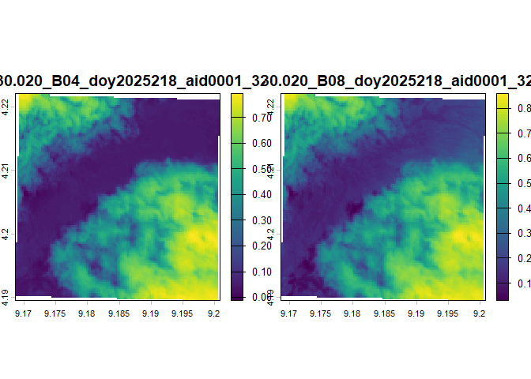
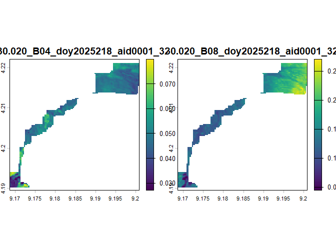

<!-- README.md is generated from README.Rmd. Please edit that file -->

<div align="center">


</div>

# hlsmanager

<!-- badges: start -->

<!-- badges: end -->

## 1. Key features

The goal of hlsmanager is to simplify to work with the HLS dataset from
NASA. When downloaded from NASA AppEEARS; all the bands get saved as on
tiff-file and the user has to merge them based on their filename. With
this package is easy to get: 1. an overview about the data you
downloaded  
2. merge them based on the default filename 3. cloud mask them

The data can be downloaded from:
<https://appeears.earthdatacloud.nasa.gov/?_ga=2.43130661.1417310973.1723470150-437277444.1719598629>
All the steps are consecutive and can be considered the first part of
your workflow.

## 2. Using auto_df to get an overview of the data

``` r


summary_df <- hlsmanager::auto_df("C:/Users/miles/OneDrive/Dokumente/EAGLE/karlakolumna/tiffsasdownloaded", calculate_non_na_pixels = T) # HLS data as downloaded
#> [1] "dataframe with,  15  was created."
head(summary_df)
#>   year doy band
#> 1 2025 218  B04
#> 2 2025 228  B04
#> 3 2025 233  B04
#> 4 2025 235  B04
#> 5 2025 243  B04
#> 6 2025 218  B08
#>                                                                                                           filepath
#> 1 C:/Users/miles/OneDrive/Dokumente/EAGLE/karlakolumna/tiffsasdownloaded/HLSS30.020_B04_doy2025218_aid0001_32N.tif
#> 2 C:/Users/miles/OneDrive/Dokumente/EAGLE/karlakolumna/tiffsasdownloaded/HLSS30.020_B04_doy2025228_aid0001_32N.tif
#> 3 C:/Users/miles/OneDrive/Dokumente/EAGLE/karlakolumna/tiffsasdownloaded/HLSS30.020_B04_doy2025233_aid0001_32N.tif
#> 4 C:/Users/miles/OneDrive/Dokumente/EAGLE/karlakolumna/tiffsasdownloaded/HLSS30.020_B04_doy2025235_aid0001_32N.tif
#> 5 C:/Users/miles/OneDrive/Dokumente/EAGLE/karlakolumna/tiffsasdownloaded/HLSS30.020_B04_doy2025243_aid0001_32N.tif
#> 6 C:/Users/miles/OneDrive/Dokumente/EAGLE/karlakolumna/tiffsasdownloaded/HLSS30.020_B08_doy2025218_aid0001_32N.tif
#>                                    filename satellite_typ non_na_pixels
#> 1 HLSS30.020_B04_doy2025218_aid0001_32N.tif      sentinel     0.9593137
#> 2 HLSS30.020_B04_doy2025228_aid0001_32N.tif      sentinel     0.9593137
#> 3 HLSS30.020_B04_doy2025233_aid0001_32N.tif      sentinel     0.9593137
#> 4 HLSS30.020_B04_doy2025235_aid0001_32N.tif      sentinel     0.9593137
#> 5 HLSS30.020_B04_doy2025243_aid0001_32N.tif      sentinel     0.9593137
#> 6 HLSS30.020_B08_doy2025218_aid0001_32N.tif      sentinel     0.9593137
```

## 3.1 Using autogroup to stack the bands

``` r

hlsmanager::auto_group("C:/Users/miles/OneDrive/Dokumente/EAGLE/karlakolumna/tiffsasdownloaded", "C:/Users/miles/OneDrive/Dokumente/EAGLE/karlakolumna/grouped")
#> [1] "dataframe with,  15  was created."
#> [1] "2025_218-stack was saved."
#> [1] "2025_228-stack was saved."
#> [1] "2025_233-stack was saved."
#> [1] "2025_235-stack was saved."
#> [1] "2025_243-stack was saved."
#> [1] "All rasterstacks seems to have the same amount of bands. The data should be complete."
#> [1] "5 RASTERSTACKS WERE SAVED."

print(paste("Number of files downloaded",length(list.files("C:/Users/miles/OneDrive/Dokumente/EAGLE/karlakolumna/tiffsasdownloaded"))))
#> [1] "Number of files downloaded 15"

print(paste("Number of files grouped",length(list.files("C:/Users/miles/OneDrive/Dokumente/EAGLE/karlakolumna/grouped"))))
#> [1] "Number of files grouped 5"

# The data consists of 5 scenes with 3 bands each, including the FMask-layer. With this function, all the bands where grouped
# into the five scenes.

terra::plot(terra::rast(list.files("C:/Users/miles/OneDrive/Dokumente/EAGLE/karlakolumna/grouped", full.names=T)[1])[[1:2]])
```



## 3.2 Using auto_group to stack the bands (with missing bands)

``` r

# In case some files are missing, the function give a warning and an overview of the bands. 
hlsmanager::auto_group("C:/Users/miles/OneDrive/Dokumente/EAGLE/karlakolumna/tiffsasdownloaded_missing", "C:/Users/miles/OneDrive/Dokumente/EAGLE/karlakolumna/grouped_missing")
#> [1] "dataframe with,  14  was created."
#> [1] "2025_218-stack was saved."
#> [1] "2025_233-stack was saved."
#> [1] "2025_235-stack was saved."
#> [1] "2025_243-stack was saved."
#> [1] "2025_228-stack was saved."
#> [1] "Not all the rasterstacks have the same amount of bands. Here you can see the statistics of the rasterstacks and the number of bands. The Fmask is counted as a band as well. You can still use the data, its just not complete."
#>   year doy number_of_bands
#> 1 2025 218               3
#> 2 2025 233               3
#> 3 2025 235               3
#> 4 2025 243               3
#> 5 2025 228               2
#> [1] "5 RASTERSTACKS WERE SAVED."
# In this case, the scene from 2025 doy 228 has only 2 bands and is therefore missing one. 
```

## 4. Using automask to cloudmask the grouped data

``` r

hlsmanager::auto_mask("C:/Users/miles/OneDrive/Dokumente/EAGLE/karlakolumna/grouped", "C:/Users/miles/OneDrive/Dokumente/EAGLE/karlakolumna/masked",   filterClouds = TRUE, filterAdjacent = TRUE, filterCloudshadow = TRUE, filterSnowice = FALSE, filterWater = FALSE, filterAerosol_climatology = FALSE, filterAerosol_low = FALSE, filterAerosol_moderate = FALSE, filterAerosol_high = FALSE)
#> [1] "C:/Users/miles/OneDrive/Dokumente/EAGLE/karlakolumna/masked/MASKED_HLS_STACK_2025_218_B04-B08-Fmask.tif was filtered and saved."
#> [1] "C:/Users/miles/OneDrive/Dokumente/EAGLE/karlakolumna/masked/MASKED_HLS_STACK_2025_228_B04-B08-Fmask.tif was filtered and saved."
#> [1] "C:/Users/miles/OneDrive/Dokumente/EAGLE/karlakolumna/masked/MASKED_HLS_STACK_2025_233_B04-B08-Fmask.tif was filtered and saved."
#> [1] "C:/Users/miles/OneDrive/Dokumente/EAGLE/karlakolumna/masked/MASKED_HLS_STACK_2025_235_B04-B08-Fmask.tif was filtered and saved."
#> [1] "C:/Users/miles/OneDrive/Dokumente/EAGLE/karlakolumna/masked/MASKED_HLS_STACK_2025_243_B04-B08-Fmask.tif was filtered and saved."
#> [1] "MASKING FINISHED."

terra::plot(terra::rast(list.files("C:/Users/miles/OneDrive/Dokumente/EAGLE/karlakolumna/masked", full.names=T)[1])[[1:2]])
```


