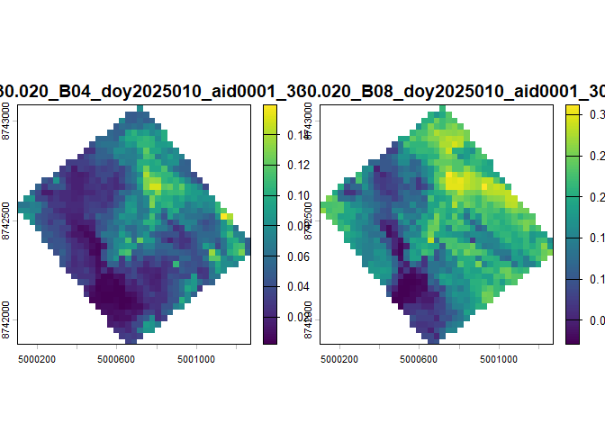
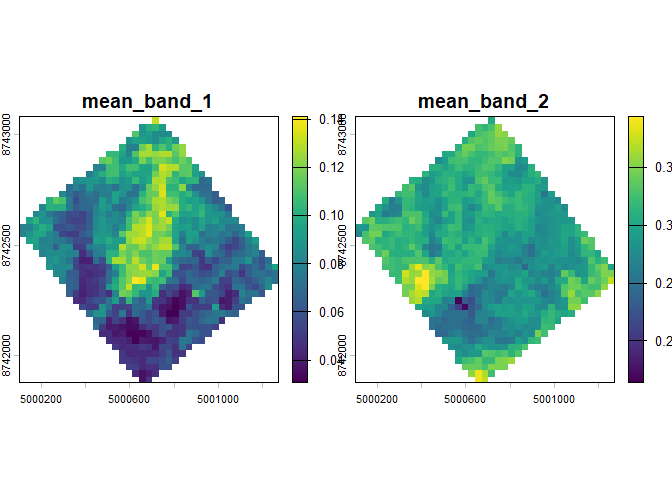

<!-- README.md is generated from README.Rmd. Please edit that file -->

<div align="center">


</div>

# hlsmanager

<!-- badges: start -->

<!-- badges: end -->

## 1. Introduction

The goal of hlsmanager is to simplify to work with the HLS dataset from
NASA. When downloaded from NASA AppEEARS; all the bands get saved as on
tiff-file and the user has to merge them based on their filename.  

This package offers:  

1.  an overview about the data you downloaded 
2.  merge them based on the default filename  
3.  cloud mask them  
4.  Reduce data to temporal means/median/sd.

The data can be downloaded from:
<https://appeears.earthdatacloud.nasa.gov/?_ga=2.43130661.1417310973.1723470150-437277444.1719598629>
All the steps are consecutive and can be considered the first part of
your analysis workflow. The package is based on the naming convention of
NASAAppears, its crucial to not rename the files. In case of unexpected
error, dont use filepaths that include underscores. The package never
loads all data into RAM, so it can be used to process a large number of
scenes.

Possible hlsmanager workflow:

<div align="center">


</div>

## 2. Using auto_df to get an overview of the data

``` r
library(hlsmanager)

summary_df <- hlsmanager::auto_df("C:/Users/miles/OneDrive/Dokumente/EAGLE WiSe/karlakolumna/tiffs_as_downloaded", calculate_non_na_pixels = T) # HLS data as downloaded
#> [1] "dataframe with,  471  was created."
head(summary_df)
#>   year doy band
#> 1 2025   2  B04
#> 2 2025   5  B04
#> 3 2025  10  B04
#> 4 2025  12  B04
#> 5 2025  15  B04
#> 6 2025  17  B04
#>                                                                                                                  filepath
#> 1 C:/Users/miles/OneDrive/Dokumente/EAGLE WiSe/karlakolumna/tiffs_as_downloaded/HLSS30.020_B04_doy2025002_aid0001_30N.tif
#> 2 C:/Users/miles/OneDrive/Dokumente/EAGLE WiSe/karlakolumna/tiffs_as_downloaded/HLSS30.020_B04_doy2025005_aid0001_30N.tif
#> 3 C:/Users/miles/OneDrive/Dokumente/EAGLE WiSe/karlakolumna/tiffs_as_downloaded/HLSS30.020_B04_doy2025010_aid0001_30N.tif
#> 4 C:/Users/miles/OneDrive/Dokumente/EAGLE WiSe/karlakolumna/tiffs_as_downloaded/HLSS30.020_B04_doy2025012_aid0001_30N.tif
#> 5 C:/Users/miles/OneDrive/Dokumente/EAGLE WiSe/karlakolumna/tiffs_as_downloaded/HLSS30.020_B04_doy2025015_aid0001_30N.tif
#> 6 C:/Users/miles/OneDrive/Dokumente/EAGLE WiSe/karlakolumna/tiffs_as_downloaded/HLSS30.020_B04_doy2025017_aid0001_30N.tif
#>                                    filename satellite_typ non_na_pixels
#> 1 HLSS30.020_B04_doy2025002_aid0001_30N.tif      sentinel     0.5339744
#> 2 HLSS30.020_B04_doy2025005_aid0001_30N.tif      sentinel     0.5339744
#> 3 HLSS30.020_B04_doy2025010_aid0001_30N.tif      sentinel     0.5339744
#> 4 HLSS30.020_B04_doy2025012_aid0001_30N.tif      sentinel     0.5339744
#> 5 HLSS30.020_B04_doy2025015_aid0001_30N.tif      sentinel     0.5339744
#> 6 HLSS30.020_B04_doy2025017_aid0001_30N.tif      sentinel     0.5339744
```

## 3.1 Using autogroup to stack the bands

``` r

hlsmanager::auto_group("C:/Users/miles/OneDrive/Dokumente/EAGLE WiSe/karlakolumna/tiffs_as_downloaded", "C:/Users/miles/OneDrive/Dokumente/EAGLE WiSe/karlakolumna/grouped", verbose = FALSE)
#> [1] "dataframe with,  471  was created."
#> [1] "All rasterstacks seems to have the same amount of bands. The data should be complete."
#> [1] "157 RASTERSTACKS WERE SAVED."

print(paste("Number of files downloaded",length(list.files("C:/Users/miles/OneDrive/Dokumente/EAGLE WiSe/karlakolumna/tiffs_as_downloaded"))))
#> [1] "Number of files downloaded 471"

print(paste("Number of files grouped",length(list.files("C:/Users/miles/OneDrive/Dokumente/EAGLE WiSe/karlakolumna/grouped"))))
#> [1] "Number of files grouped 157"


terra::plot(terra::rast(list.files("C:/Users/miles/OneDrive/Dokumente/EAGLE WiSe/karlakolumna/grouped", full.names=T)[1])[[1:2]])
```



## 3.2 Using auto_group to stack the bands (with missing bands)

``` r

# In case some files are missing, the function give a warning and an overview of the bands. 
# Here we can see a missing band from the doy 157 scene.
hlsmanager::auto_group("C:/Users/miles/OneDrive/Dokumente/EAGLE WiSe/karlakolumna/tiffs_as_downloaded_missing", "C:/Users/miles/OneDrive/Dokumente/EAGLE WiSe/karlakolumna/grouped_missing", verbose = FALSE)
#> [1] "dataframe with,  470  was created."
#> [1] "Not all the rasterstacks have the same amount of bands. Here you can see the statistics of the rasterstacks and the number of bands. The Fmask is counted as a band as well. You can still use the data, its just not complete."
#>     year doy number_of_bands
#> 1   2025   2               3
#> 2   2025   5               3
#> 3   2025  10               3
#> 4   2025  12               3
#> 5   2025  15               3
#> 6   2025  17               3
#> 7   2025  25               3
#> 8   2025  27               3
#> 9   2025  30               3
#> 10  2025  32               3
#> 11  2025  35               3
#> 12  2025  37               3
#> 13  2025  40               3
#> 14  2025  42               3
#> 15  2025  45               3
#> 16  2025  47               3
#> 17  2025  50               3
#> 18  2025  55               3
#> 19  2025  57               3
#> 20  2025  60               3
#> 21  2025  62               3
#> 22  2025  70               3
#> 23  2025  72               3
#> 24  2025  75               3
#> 25  2025  77               3
#> 26  2025  79               3
#> 27  2025  82               3
#> 28  2025  85               3
#> 29  2025  87               3
#> 30  2025  89               3
#> 31  2025  90               3
#> 32  2025  92               3
#> 33  2025  95               3
#> 34  2025  97               3
#> 35  2025  99               3
#> 36  2025 102               3
#> 37  2025 105               3
#> 38  2025 107               3
#> 39  2025 109               3
#> 40  2025 110               3
#> 41  2025 112               3
#> 42  2025 115               3
#> 43  2025 117               3
#> 44  2025 122               3
#> 45  2025 125               3
#> 46  2025 127               3
#> 47  2025 129               3
#> 48  2025 130               3
#> 49  2025 132               3
#> 50  2025 135               3
#> 51  2025 137               3
#> 52  2025 139               3
#> 53  2025 140               3
#> 54  2025 142               3
#> 55  2025 145               3
#> 56  2025 147               3
#> 57  2025 149               3
#> 58  2025 150               3
#> 59  2025 152               3
#> 60  2025 155               3
#> 61  2025 157               3
#> 62  2025 159               3
#> 63  2025 160               3
#> 64  2025 162               3
#> 65  2025 165               3
#> 66  2025 167               3
#> 67  2025 169               3
#> 68  2025 170               3
#> 69  2025 172               3
#> 70  2025 175               3
#> 71  2025 177               3
#> 72  2025 179               3
#> 73  2025 180               3
#> 74  2025 182               3
#> 75  2025 185               3
#> 76  2025 187               3
#> 77  2025 189               3
#> 78  2025 190               3
#> 79  2025 192               3
#> 80  2025 195               3
#> 81  2025 197               3
#> 82  2025 199               3
#> 83  2025 200               3
#> 84  2025 202               3
#> 85  2025 205               3
#> 86  2025 207               3
#> 87  2025 209               3
#> 88  2025 210               3
#> 89  2025 212               3
#> 90  2025 215               3
#> 91  2025 217               3
#> 92  2025 219               3
#> 93  2025 222               3
#> 94  2025 225               3
#> 95  2025 227               3
#> 96  2025 229               3
#> 97  2025 230               3
#> 98  2025 232               3
#> 99  2025 235               3
#> 100 2025 237               3
#> 101 2025 239               3
#> 102 2025 240               3
#> 103 2025 242               3
#> 104 2025 245               3
#> 105 2025 247               3
#> 106 2025 249               3
#> 107 2025 252               3
#> 108 2025 255               3
#> 109 2025 257               3
#> 110 2025 259               3
#> 111 2025 260               3
#> 112 2025 262               3
#> 113 2025 265               3
#> 114 2025 269               3
#> 115 2025 270               3
#> 116 2025 275               3
#> 117 2025 277               3
#> 118 2025 279               3
#> 119 2025 280               3
#> 120 2025 282               3
#> 121 2025 285               3
#> 122 2025 287               3
#> 123 2025 289               3
#> 124 2025 290               3
#> 125 2025 292               3
#> 126 2025 295               3
#> 127 2025 297               3
#> 128 2025 300               3
#> 129 2025 302               3
#> 130 2025 305               3
#> 131 2025 307               3
#> 132 2025 309               3
#> 133 2025 312               3
#> 134 2025 315               3
#> 135 2025 319               3
#> 136 2025 320               3
#> 137 2025 322               3
#> 138 2025 325               3
#> 139 2025 327               3
#> 140 2025 329               3
#> 141 2025 330               3
#> 142 2025 332               3
#> 143 2025 335               3
#> 144 2025 337               3
#> 145 2025 339               3
#> 146 2025 340               3
#> 147 2025 342               3
#> 148 2025 345               3
#> 149 2025 347               3
#> 150 2025 349               3
#> 151 2025 350               3
#> 152 2025 352               3
#> 153 2025 355               3
#> 154 2025 359               3
#> 155 2025 360               3
#> 156 2025 362               3
#> 157 2025  22               2
#> [1] "157 RASTERSTACKS WERE SAVED."
```

## 4. Using auto_mask to cloudmask the grouped data

``` r

hlsmanager::auto_mask("C:/Users/miles/OneDrive/Dokumente/EAGLE WiSe/karlakolumna/grouped", "C:/Users/miles/OneDrive/Dokumente/EAGLE WiSe/karlakolumna/masked",   filterClouds = TRUE, filterAdjacent = TRUE, filterCloudshadow = TRUE, filterSnowice = FALSE, filterWater = FALSE, filterAerosol_climatology = FALSE, filterAerosol_low = FALSE, filterAerosol_moderate = FALSE, filterAerosol_high = FALSE, verbose = FALSE)
#> [1] "MASKING FINISHED."
```

## 5. Using the reducer function to compute means

``` r
# With this command we compute the monthly mean.
# Most of the intervalls will be empty and we will get an error message for that.
# computation is still carried out with the non-empty intervalls.
# All the reducer_modes ignore NAs. 


reducer(1, 365, 30, reducer = "mean", "C:/Users/miles/OneDrive/Dokumente/EAGLE WiSe/karlakolumna/masked", "C:/Users/miles/OneDrive/Dokumente/EAGLE WiSe/karlakolumna/mean", verbose = FALSE)
#> The time intervall from   to 1 in the year 2025 has no scenes. The next step is computed instead.
#> 
#> [1] "Raster from 1 to 31 was calculated."
#> [1] "Raster from 31 to 61 was calculated."
#> [1] "Raster from 61 to 91 was calculated."
#> [1] "Raster from 91 to 121 was calculated."
#> [1] "Raster from 121 to 151 was calculated."
#> [1] "Raster from 151 to 181 was calculated."
#> [1] "Raster from 181 to 211 was calculated."
#> [1] "Raster from 211 to 241 was calculated."
#> [1] "Raster from 241 to 271 was calculated."
#> [1] "Raster from 271 to 301 was calculated."
#> [1] "Raster from 301 to 331 was calculated."
#> [1] "Raster from 331 to 361 was calculated."
#> THE YEAR 2025 IS FINISHED.
#> 
#> [1] "FUNCTION ENDED SUCCESFULLY.\n\n"

terra::plot(terra::rast(list.files("C:/Users/miles/OneDrive/Dokumente/EAGLE WiSe/karlakolumna/mean", full.names = T)[2]))
```


